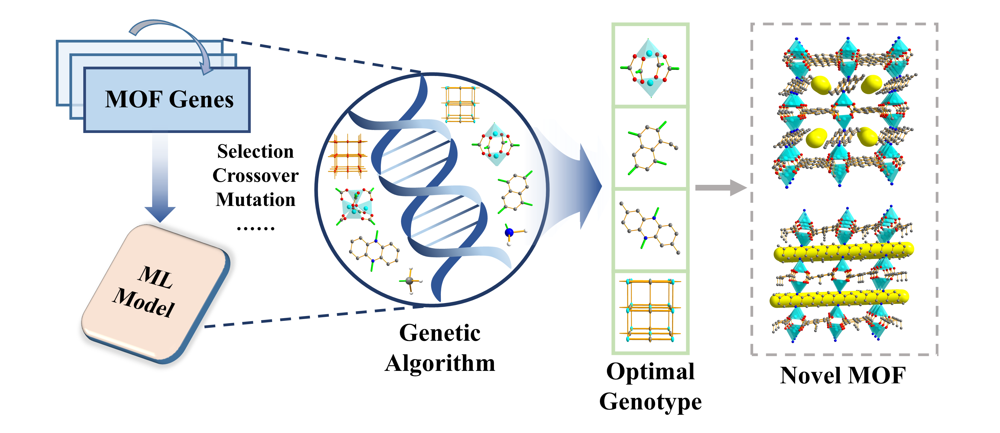

<div align="center">

<h2>Inverse Design of Metal-Organic Frameworks for CH<sub>4</sub>/N<sub>2</sub> Separation Enabled by Coupled Machine Learning and Genetic Algorithms</h2>


## 📌 Introduction



**This repository** implements the **Tangent Adaptive Genetic Algorithm (TAGA)** for the optimization of metal-organic frameworks (MOFs) targeting CH<sub>4</sub>/N<sub>2</sub> separation. It features a **trainable XGBoost machine learning model** for predicting CH<sub>4</sub>/N<sub>2</sub> selectivity, which guides the evolutionary search toward high-performance candidates. By coupling adaptive genetic optimization with predictive modeling, the workflow enables efficient inverse design of MOFs for enhanced separation performance.

---

## 📂 Project Structure

| File | Description |
|------|-------------|
| **TAGA4MOF.py** | Contains the  GeneticOptimizer class for MOF inverse design. |
| **RUN_TAGA.py** | Main script to run the GA workflow. |
| **ML_training.py** | Trains machine learning regression models, visualizes training results, and saves the model. |
| **ML_predict.py** | Performs property prediction using the trained ML model and conducts **SHAP** interpretability analysis. |

---

## 📦 Dependencies
The project requires the following Python packages:
```bash
scikit-learn
xgboost
shap
matplotlib
seaborn
```

Install them via:
```bash
pip install scikit-learn xgboost shap matplotlib seaborn
```

---

## 🚀 Usage

### 1. Train the ML Model
```bash
python ML_training.py
```
- Trains the regression model.
- Saves the trained model file.
- Outputs training metrics and visualization plots.

### 2. Predict and Interpret
```bash
python ML_predict.py
```
- Loads the trained model.
- Predicts CH₄/N₂ separation performance.
- Performs **SHAP** analysis for feature importance.

### 3. Run the Genetic Algorithm
```bash
python RUN_TAGA.py
```
- Executes the **machine learning–guided genetic algorithm**.
- Generates a ranked list of candidate MOFs.

---

## 📜 Notes
- Ensure your dataset paths in `ML_training.py` and `ML_predict.py` are correctly set before running.
- The GA parameters (population size, mutation rate, generations, etc.) can be adjusted in `TAGA4MOF.py`.
- SHAP visualizations require a trained ML model.
